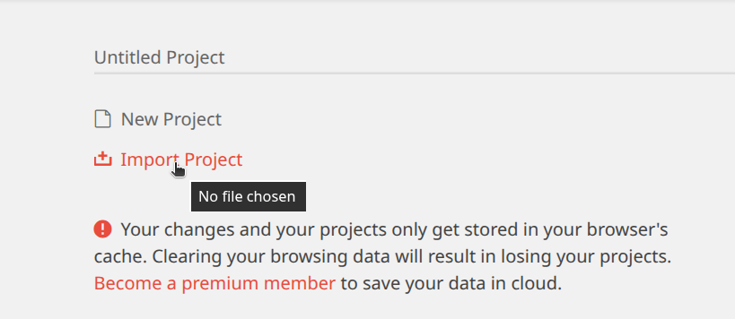
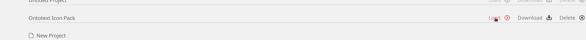
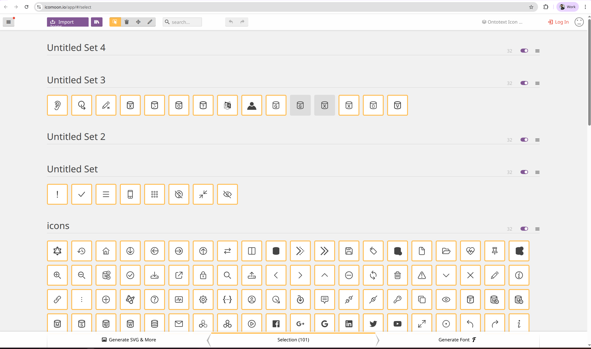
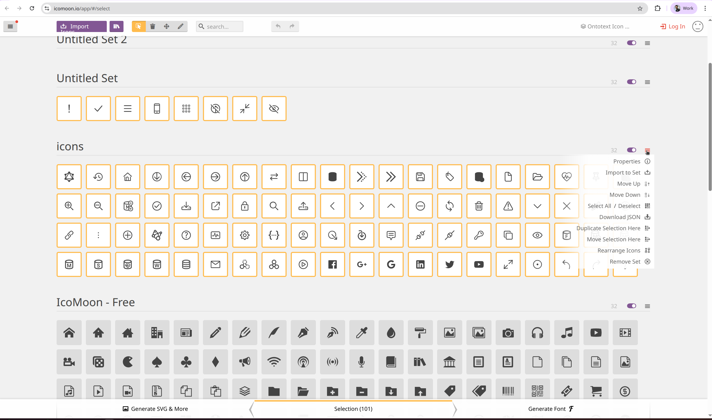
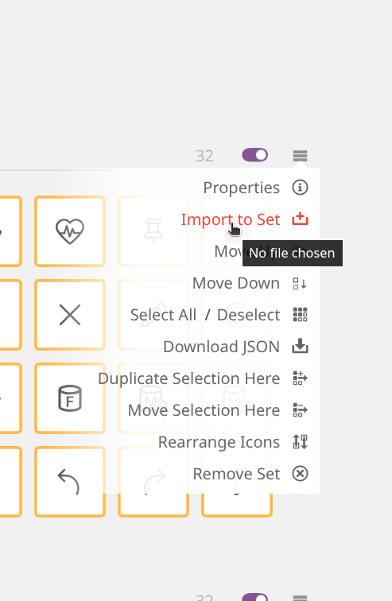
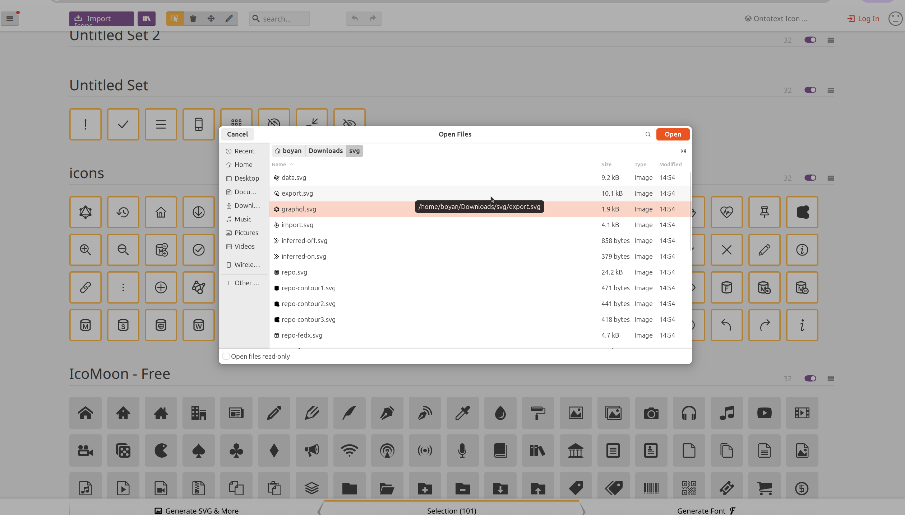
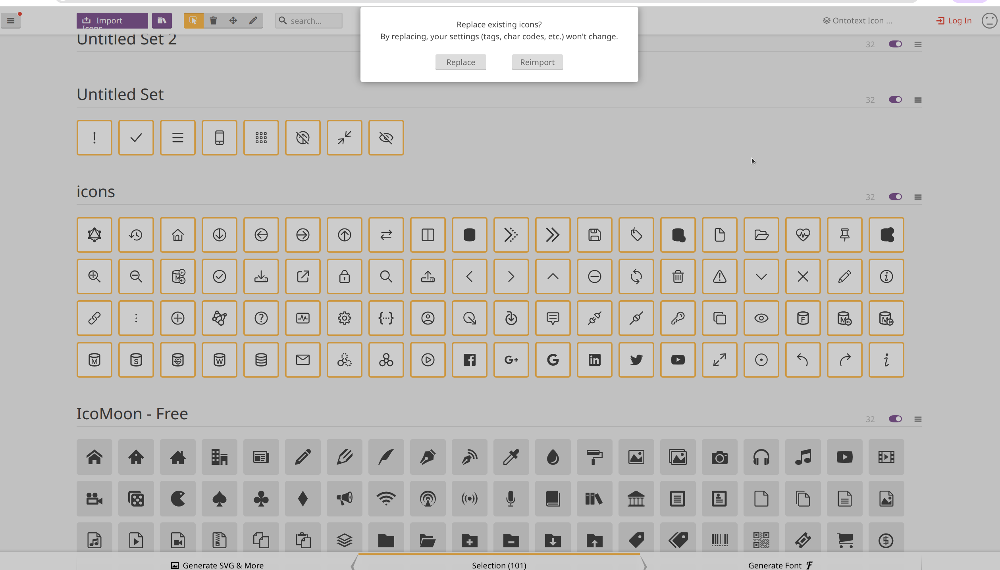
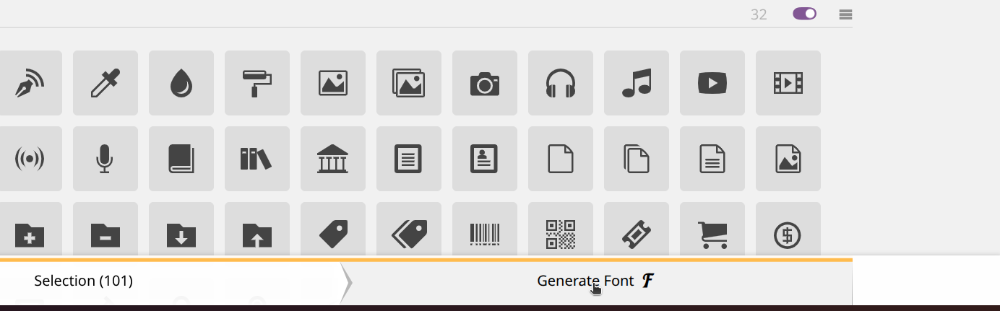
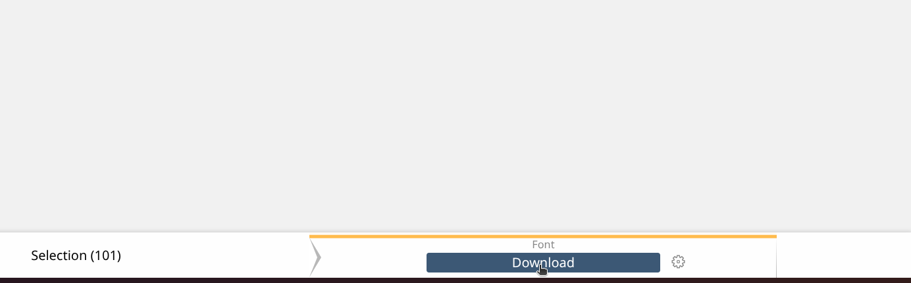
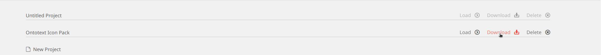

1. Go to the [IcoMoon App](https://icomoon.io/app/).
2. Choose **Manage Projects** from the far right side of the header  
   (or use [this direct link](https://icomoon.io/app/#/projects)).
3. Import the project file. Chouse the file "graphwise-icons-icomoon-project.json" or "ontotext-icons-icomoon-project.json".

4. Load the project. 
5. When the project is loaded, you will see the icons grouped into different sections, for example, “Untitled Set 2”, “Untitled Set”, “icons”.

6. Find the section where the icon needs to be replaced and click the menu icon to the right of the section. A menu with available actions will appear.

7. Click the Import to Set button.                                                      

8. Choose the icon/icons file/files to import.

9. If the icon has the same name as an existing icon in the set, a dialog will appear, asking whether you want to replace the existing icon.

10. Click Replace. The icon will be replaced.
11. Click the Generate Font button in the bottom-right corner of the page.

12. Click the Download button to download the font.

13. Unzip the downloaded file and replace its contents in the demo folder of the project, "graphwisie-icon-pack/icons-demo" or "ontotext-icon-pack/icons-demo" depends on the imported project.
14. Click the Manage Projects button in the top-right corner of the page.

15. Download the updated project file.

16. Replace the contents of the corresponding project file with the downloaded file, "graphwise-icons-icomoon-project.json"
or "ontotext-icons-icomoon-project.json" depends on the imported project.

